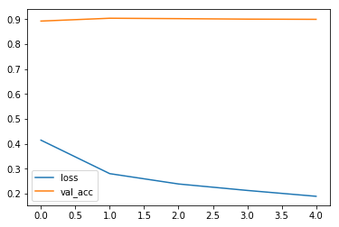
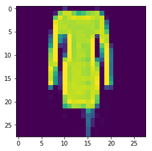

# Simple CNN model with Keras

This is a simple CNN model trained with fashion-MNIST and built with Keras.  
The data is included in the "fashionmnist" subforder and is zipped for convienence.


```python
from __future__ import print_function, division
from keras.models import Sequential,load_model
from keras.layers import Dense, Activation, MaxPooling2D, Flatten, Conv2D,Dropout, BatchNormalization
from keras.utils import to_categorical
import pandas as pd
import numpy as np
import matplotlib.pyplot as plt

# %matplotlib inline
```

    Using TensorFlow backend.


# Loading Data
1. Using zipfile to unzip the data
2. Using pandas to lead-in the data


```python
import zipfile
zip_ref = zipfile.ZipFile('./fashionmnist/fashionmnist.zip', 'r')
zip_ref.extractall('./fashionmnist/')
zip_ref.close()
```


```python
data = pd.read_csv('./fashionmnist/fashion-mnist_train.csv')
data_test = pd.read_csv('./fashionmnist/fashion-mnist_test.csv')
```


```python
data_test.head()
```


<div>
<style scoped>
    .dataframe tbody tr th:only-of-type {
        vertical-align: middle;
    }

    .dataframe tbody tr th {
        vertical-align: top;
    }

    .dataframe thead th {
        text-align: right;
    }
</style>
<table border="1" class="dataframe">
  <thead>
    <tr style="text-align: right;">
      <th></th>
      <th>label</th>
      <th>pixel1</th>
      <th>pixel2</th>
      <th>pixel3</th>
      <th>pixel4</th>
      <th>pixel5</th>
      <th>pixel6</th>
      <th>pixel7</th>
      <th>pixel8</th>
      <th>pixel9</th>
      <th>...</th>
      <th>pixel775</th>
      <th>pixel776</th>
      <th>pixel777</th>
      <th>pixel778</th>
      <th>pixel779</th>
      <th>pixel780</th>
      <th>pixel781</th>
      <th>pixel782</th>
      <th>pixel783</th>
      <th>pixel784</th>
    </tr>
  </thead>
  <tbody>
    <tr>
      <th>0</th>
      <td>0</td>
      <td>0</td>
      <td>0</td>
      <td>0</td>
      <td>0</td>
      <td>0</td>
      <td>0</td>
      <td>0</td>
      <td>9</td>
      <td>8</td>
      <td>...</td>
      <td>103</td>
      <td>87</td>
      <td>56</td>
      <td>0</td>
      <td>0</td>
      <td>0</td>
      <td>0</td>
      <td>0</td>
      <td>0</td>
      <td>0</td>
    </tr>
    <tr>
      <th>1</th>
      <td>1</td>
      <td>0</td>
      <td>0</td>
      <td>0</td>
      <td>0</td>
      <td>0</td>
      <td>0</td>
      <td>0</td>
      <td>0</td>
      <td>0</td>
      <td>...</td>
      <td>34</td>
      <td>0</td>
      <td>0</td>
      <td>0</td>
      <td>0</td>
      <td>0</td>
      <td>0</td>
      <td>0</td>
      <td>0</td>
      <td>0</td>
    </tr>
    <tr>
      <th>2</th>
      <td>2</td>
      <td>0</td>
      <td>0</td>
      <td>0</td>
      <td>0</td>
      <td>0</td>
      <td>0</td>
      <td>14</td>
      <td>53</td>
      <td>99</td>
      <td>...</td>
      <td>0</td>
      <td>0</td>
      <td>0</td>
      <td>0</td>
      <td>63</td>
      <td>53</td>
      <td>31</td>
      <td>0</td>
      <td>0</td>
      <td>0</td>
    </tr>
    <tr>
      <th>3</th>
      <td>2</td>
      <td>0</td>
      <td>0</td>
      <td>0</td>
      <td>0</td>
      <td>0</td>
      <td>0</td>
      <td>0</td>
      <td>0</td>
      <td>0</td>
      <td>...</td>
      <td>137</td>
      <td>126</td>
      <td>140</td>
      <td>0</td>
      <td>133</td>
      <td>224</td>
      <td>222</td>
      <td>56</td>
      <td>0</td>
      <td>0</td>
    </tr>
    <tr>
      <th>4</th>
      <td>3</td>
      <td>0</td>
      <td>0</td>
      <td>0</td>
      <td>0</td>
      <td>0</td>
      <td>0</td>
      <td>0</td>
      <td>0</td>
      <td>0</td>
      <td>...</td>
      <td>0</td>
      <td>0</td>
      <td>0</td>
      <td>0</td>
      <td>0</td>
      <td>0</td>
      <td>0</td>
      <td>0</td>
      <td>0</td>
      <td>0</td>
    </tr>
  </tbody>
</table>
<p>5 rows × 785 columns</p>
</div>


## Data information

Training data
- label: 0~9
- pixel 784 (28x28)
- 60000 images

Test data
- same format
- 10000 images


```python
data.shape
```


    (60000, 785)


```python
data_test.shape
```


    (10000, 785)


## One-hot encoding of labels


```python
# Both method works
# y_train = pd.get_dummies(data['label']).values.astype(np.int32)


y_train = to_categorical(data['label'],num_classes=10)
```


```python
# Making sure the format is as expected
y_train[0]
```


    array([0., 0., 1., 0., 0., 0., 0., 0., 0., 0.], dtype=float32)


```python
# y_test = pd.get_dummies(data_test['label']).values.astype(np.int32)

y_test = to_categorical(data_test['label'],num_classes=10)
```

## Reshaping & normalizing images


```python
X_train = data.values[:, 1:].reshape([-1,28,28,1])/255.0
```


```python
X_train.shape
```


    (60000, 28, 28, 1)


```python
X_test = data_test.values[:, 1:].reshape([-1,28,28,1])/255.0
```


```python
X_test.shape
```


    (10000, 28, 28, 1)


# Building model
- 3 layers of convolution
- 2 fully-connected layers


```python
model = Sequential()
```


```python
model.add(Conv2D(input_shape=(28, 28,1), filters=32, kernel_size=(3, 3)))
model.add(BatchNormalization())
model.add(Activation('relu'))
model.add(MaxPooling2D(2, 2, 'same', data_format='channels_last'))
```


```python
model.add(Conv2D(filters=64,kernel_size=(3,3),strides=1))
model.add(BatchNormalization())
model.add(Activation('relu'))
model.add(MaxPooling2D(2, 2, 'same', data_format='channels_last'))
```


```python
model.add(Conv2D(filters=128,kernel_size=(3,3),strides=1))
model.add(BatchNormalization())
model.add(Activation('relu'))
model.add(MaxPooling2D(2, 2, 'same', data_format='channels_last'))
```


```python
model.add(Flatten())
model.add(Dense(300))
model.add(Activation('relu'))
model.add(Dropout(0.2))
```


```python
model.add(Dense(10))
model.add(Activation('softmax'))
```

## Compile the model and export the accuracy matrics


```python
model.compile(optimizer='adam',
              loss='categorical_crossentropy',
              metrics=['accuracy'])
```


```python
# training_history = model.fit(x=X_train, y=y_train,validation_data=(X_test, y_test), epochs=3, batch_size=64,shuffle=True)
training_history = model.fit(x=X_train, y=y_train,validation_data=(X_test, y_test), epochs=5, batch_size=64,shuffle=True)
```

    Train on 60000 samples, validate on 10000 samples
    Epoch 1/5
    60000/60000 [==============================] - 12s 193us/step - loss: 0.4143 - acc: 0.8497 - val_loss: 0.2927 - val_acc: 0.8921
    Epoch 2/5
    60000/60000 [==============================] - 10s 163us/step - loss: 0.2799 - acc: 0.8974 - val_loss: 0.2627 - val_acc: 0.9035
    Epoch 3/5
    60000/60000 [==============================] - 10s 163us/step - loss: 0.2384 - acc: 0.9131 - val_loss: 0.2517 - val_acc: 0.9019
    Epoch 4/5
    60000/60000 [==============================] - 10s 163us/step - loss: 0.2125 - acc: 0.9217 - val_loss: 0.2762 - val_acc: 0.8999
    Epoch 5/5
    60000/60000 [==============================] - 10s 164us/step - loss: 0.1889 - acc: 0.9302 - val_loss: 0.2974 - val_acc: 0.8991


# Saving the model


```python
model.save('fashion_mnist.h5')
```


```python
# Plotting the accuracy metrics
plt.plot(training_history.history['loss'], label='loss')
plt.plot(training_history.history['val_acc'], label='val_acc')
plt.legend()
plt.show()
```





# Loading the model and making predition


```python
img = X_test[4].reshape([28,28])
```


```python
# Check above for its label, 3
plt.imshow(img)
```


    <matplotlib.image.AxesImage at 0x7fd7a9989048>





```python
# deleting the model and reloading it
del model
model = load_model('fashion_mnist.h5')
```

# Making prediction


```python
# single prediction
probabilities = model.predict_classes(X_test[4].reshape([-1,28,28,1]))
```


```python
probabilities
```


    array([3])


```python
# batch prediction
probabilities = model.predict_classes(X_test)
```


```python
predictions = [int(round(x)) for x in probabilities]
```


```python
# decoding one-hot
np.argmax(y_test, axis=1)
```


    array([0, 1, 2, ..., 8, 8, 1])


```python
accuracy = np.mean(np.equal(predictions, np.argmax(y_test, axis=1)))
print("Accuracy of test set is", accuracy)
```

    Accuracy of test set is 0.8991


# release GPU memory
- Sometimes, after several times training, I see a warining of running out of GPU's memory


```python
from keras import backend as K
K.clear_session()
```
